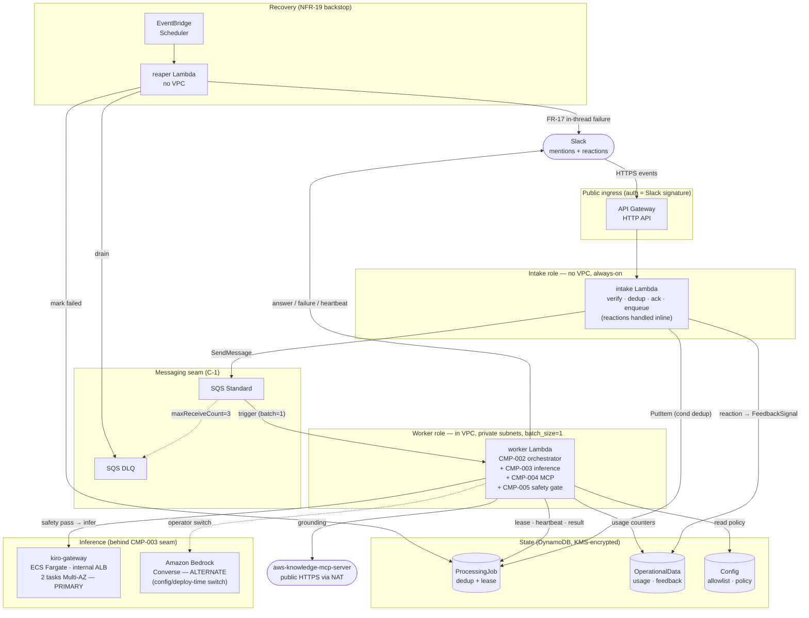
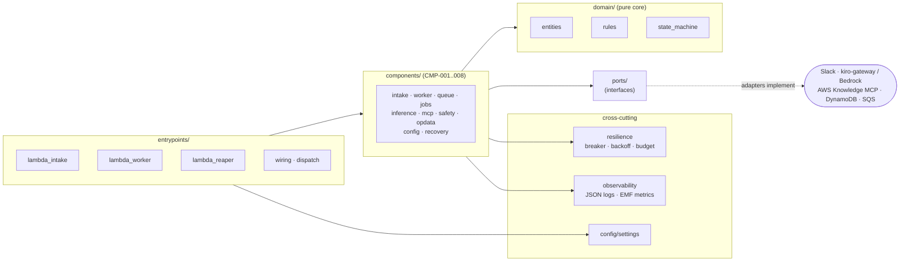

# Slack DevOps Agent — UNIT-001

A Slack bot that answers AWS/DevOps questions in allowlisted channels: it acknowledges
fast, processes asynchronously, grounds answers in AWS Knowledge MCP sources, reviews
attached IaC files, gates input for secrets, enforces an architecture-only content
guardrail, and records adoption/feedback/usage metrics.

This package is a **modular monolith** (one artifact, three Lambda roles):

- **intake** (`entrypoints/lambda_intake.py`) — Slack Events API ingress (mentions +
  reactions), fast ack, enqueue.
- **worker** (`entrypoints/lambda_worker.py`) — SQS-driven async agent loop.
- **reaper** (`entrypoints/lambda_reaper.py`) — EventBridge-scheduled in-flight recovery.

External dependencies (Slack, the inference backend, AWS Knowledge MCP, DynamoDB, SQS) sit
behind ports/adapters so the agent core is testable without live backends.

> **How "running" works:** there is no standalone server process — the three entrypoints are
> AWS Lambda handlers. Locally you **develop and test** the code (§ Quick start); to actually
> **run** the bot you **deploy** it to AWS (§ Run / deploy). Jump to
> [Quick start](#quick-start) or [Run / deploy](#run--deploy).

## Capabilities

- **Q&A** — `@devops-agent <question>` in an allowlisted channel; the bot acks, processes
  asynchronously, and answers in-thread, grounded where possible in AWS Knowledge MCP sources.
- **File review** — attach a text/IaC file (`.yaml/.yml/.json/.tf/.hcl/.txt/.md/.template`,
  ≤256 KB) and the bot includes its content in the review. Other types/oversize files are
  declined with a notice; requires the Slack app's **`files:read`** scope.
- **Content guardrail** — an operator system prompt restricts answers to AWS architecture /
  DevOps, resists prompt-injection, and declines off-topic or PII/secret-disclosure requests
  (`components/inference/system_prompt.py`).
- **Input safety gate** — assembled input (including any attached file) is scanned for secrets
  before it reaches an inference backend; a positive detection refuses the request
  (`components/safety/scanner.py`).
- **Feedback** — 👍/👎 reactions on a bot answer are captured as adoption/feedback signals.

## Quick start

### 1. Prerequisites

| Tool | Version | Purpose |
|---|---|---|
| Python | 3.12+ | runtime |
| [uv](https://docs.astral.sh/uv/) | latest | dependency + venv management |

Cloud deploy additionally needs the AWS CLI v2, Terraform ≥ 1.6, Docker, and a logged-in
`kiro-cli` — see [Run / deploy](#run--deploy).

### 2. Install

```bash
# clone, then from the repo root:
uv sync --extra dev
```

`uv sync` creates the `.venv` and installs runtime + dev dependencies pinned in `uv.lock`.
Prefix commands with `uv run` to use that environment (no manual `activate` needed).

### 3. Develop & test

```bash
uv run pytest                  # full test suite
uv run ruff check .            # lint
uv run ruff format --check .   # format check
uv run mypy                    # type check (strict)
uv run bandit -r src/          # security lint
```

The agent core is fully testable without any AWS/Slack credentials — adapters are faked
behind ports. The test suite is the local "does it work" signal; there is no local server to
start.

### 4. Run / deploy

Running the bot = deploying it to AWS (Lambda + Fargate). The full step-by-step runbook
(existing VPC, secrets from `.env`, one-command apply) lives in
**[docs/DEPLOY-EXISTING-VPC.md](docs/DEPLOY-EXISTING-VPC.md)**; architecture/cost detail is in
[docs/DEPLOYMENT.md](docs/DEPLOYMENT.md). The short version:

```bash
cp .env.example .env && $EDITOR .env          # Slack tokens, PROXY_API_KEY, SLACK_BOT_USER_ID
cp scripts/deploy.env.example deploy.env && $EDITOR deploy.env   # VPC/subnet/SG IDs + backend

scripts/bootstrap-backend.sh -b <state-bucket> -t <lock-table> -r us-east-1   # one-time
scripts/build-lambda.sh -b <artifacts-bucket> -r us-east-1                    # build Lambda zip

scripts/deploy.sh                              # plan (safe, read-only)
scripts/deploy.sh --apply --load-kiro-creds    # apply + load secrets from .env + Kiro creds
```

`scripts/deploy.sh` plans by default; `--apply` is the only thing that mutates AWS. Secrets
are read from `.env` and pushed to Secrets Manager automatically — never committed.

### Operational notes

- **Slack scopes** — file review needs the **`files:read`** bot scope (reinstall after adding);
  the bot user id (`SLACK_BOT_USER_ID`) gates self-mentions. Without `files:read`, Slack omits
  the file from the event and the bot reviews text only.
- **Intake Lambda alias** — API Gateway invokes the intake function via a published-version
  **alias** (`live`), not `$LATEST`. After updating intake code you must publish a new version
  **and** move the alias, or the new code never serves traffic. The worker/reaper run `$LATEST`
  (SQS/EventBridge invoke the bare function), so a code update is enough for them.
- **Inference reachability** — the worker reaches the kiro-gateway over the internal ALB; the
  channel allowlist, usage guardrail, MCP base URL, and inference timeout are runtime config
  (DynamoDB `Config` items / Lambda env), not code.

## Architecture & Infrastructure

### Runtime topology (AWS)

How a request flows through the deployed infrastructure. The system splits at the durable
**C-1 queue seam** into an always-on **intake** role and a horizontally-scalable **worker**
role; a scheduled **reaper** recovers abandoned jobs.



### Code architecture (ports & adapters)

One artifact, three Lambda entrypoints. The domain core never imports an adapter — all
external systems are reached through ports, so the agent loop is unit-testable without live
backends.



## Inference backend (CMP-003)

Kiro-gateway is the **primary** backend, integrated **HTTP-client-only** against an
OpenAI-compatible `POST /v1/chat/completions` (bearer `PROXY_API_KEY`). The gateway is
operated as a **separate, unmodified, external** AGPL-3.0 container — it is **never**
vendored, forked, or imported into this codebase, which bounds AGPL source-disclosure
obligations. Amazon Bedrock is the config-switchable alternate behind the same interface.

## Design artifacts

See `org-ai-kb/aidlc-docs/intent-001-slack-devops-agent/stages/construction/UNIT-001/`
for the design artifacts (entities, rules, NFR, infrastructure) and `implementation-map.md`
in the `code-generation/` stage directory for the ID → file/test traceability. Day-to-day
commands (install, test, lint) are in [Quick start](#quick-start).
