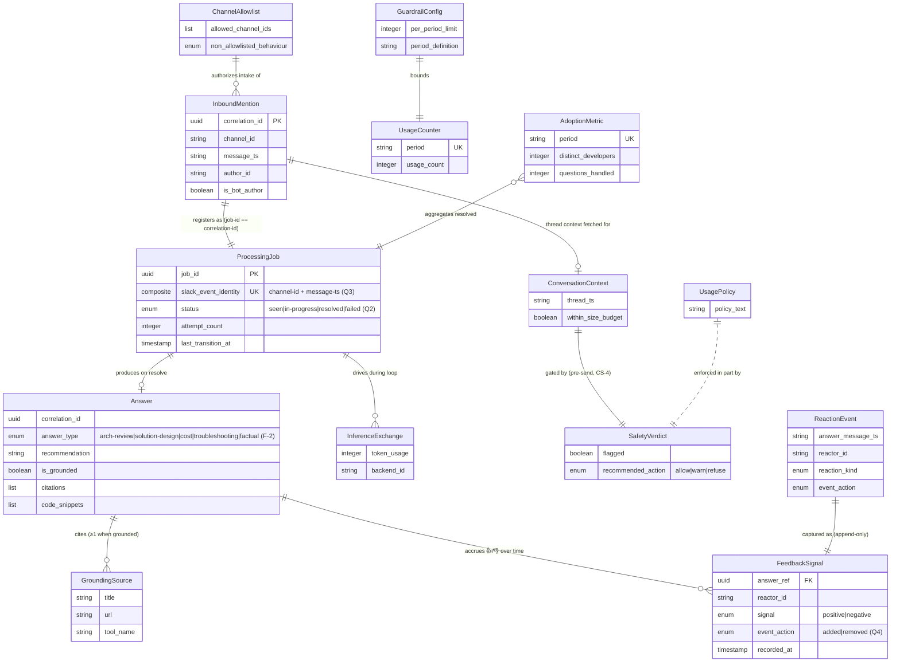

# Functional Spec — Slack DevOps Agent (UNIT-001)

> Intent: **Slack DevOps Agent Bot** (`intent-001-slack-devops-agent`) ·
> Stage: `functional-design` (construction) · Unit: **UNIT-001** ·
> Owner: aidlc-systems-architect-agent.
>
> **Human-readable view.** `entities.yaml` and `rules.yaml` are the source of truth;
> this file derives from them. Decisions applied: **Q1=c** (api-spec covers external +
> internal interfaces), **Q2=b** (distinct `resolved`/`failed` terminals), **Q3=a**
> (de-dup identity = channel-id + message-ts), **Q4=b** (append-only feedback log).
>
> **Refinement pass (PM contribution applied):** **F-1** feedback aggregation refined to
> per-(answer, reactor, signal) so a withdrawn 👎 cannot erase a present 👍 (BR-020/ENT-010);
> **F-2** `Answer.answer-type` modelled and set in W2 so BR-015 branches on a verifiable field;
> **F-3** `non-allowlisted-behaviour` default flipped silent → reply-not-designated (Developer
> "left waiting" pain). Minor: **M-1** budget-deny message invites re-ask after reset;
> **M-2** adoption counts answered-not-demand (noted); **M-3** FR-16 narrowed to 👍/👎 for v1 (noted);
> **M-4** BR-003 trigger wording aligned to W1 order; **M-5** top-level mention → single-message context.

## Scope

| Unit | Components Covered | Source Stories |
|---|---|---|
| UNIT-001 | CMP-001..CMP-008 | S-1 .. S-27 (all 27) |

Internal modules (from `units.md`): Intake/Adapter (CMP-001) · Agent Worker
(CMP-002, CMP-004, CMP-005) · Inference Provider library (CMP-003, A-1 seam) ·
Job/State (CMP-006) · Operational Data (CMP-007) · Configuration & Policy (CMP-008).
The C-1 intake→worker queue is the internal async seam (API-INT-009).

## Entity Relationships

## State Machines

### ProcessingJob (ENT-008) — Q2=b distinct terminals

| Entity ID | Current | Event | Next | Guard |
|---|---|---|---|---|
| ENT-008 | (none) | New mention registered by identity | seen | No existing job for slack-event-identity (BR-010) |
| ENT-008 | (none) | Redelivery/re-enqueue of a known identity | (unchanged) | Existing job found → attach, no new job (BR-010) |
| ENT-008 | seen | Worker dequeues and starts | in-progress | Job not already resolved/failed (BR-011); attempt-count++ (BR-021) |
| ENT-008 | in-progress | Answer composed and posted | resolved | Answer posted successfully (W2) |
| ENT-008 | in-progress | Unrecoverable error / timeout / budget-deny / oversize-reject | failed | Terminal processing error (BR-013) |
| ENT-008 | in-progress | Worker lost (stale last-transition-at), attempts remain | in-progress | attempt-count < max-attempt (BR-021/BR-022); attempt-count++ |
| ENT-008 | in-progress | Worker lost, attempts exhausted | failed | attempt-count ≥ max-attempt → post failure message (BR-022/BR-013) |
| ENT-008 | resolved | any | — | Terminal — no transitions leave it |
| ENT-008 | failed | any | — | Terminal — no transitions leave it |

`resolved` = answer posted (success). `failed` = failure message posted (unrecoverable
error / budget-deny / oversize / exhausted retries). Both are terminal; both resolve the
FR-3 acknowledgement so it is never left dangling.

## Workflows

### W1 — Intake & acknowledge (CMP-001; intake role)

1. Receive Slack event (API-EXT-001).
2. Validate signature; parse into `InboundMention`.
3. Ignore if author is bot/self — BR-002 (FR-20/S-21).
4. Ignore if the message does not mention the bot — BR-003 (FR-1/S-1).
5. Check channel allowlist (read CMP-008) — BR-001; if not allowlisted, apply non-allowlisted-behaviour (silent or not-designated reply) and stop (S-14).
6. Register the event with the Job Coordinator by `slack-event-identity` = (channel-id, message-ts) — BR-010 (Q3). If a job already exists: if resolved/failed do nothing; if seen/in-progress do not re-ack/re-enqueue (BR-011). Else create job in `seen`.
7. For a new job: post in-thread acknowledgement and return Slack HTTP 200 within the NFR-1 window — BR-004 (FR-3/S-2).
8. Enqueue the job across the C-1 seam (API-INT-009) for async processing.

### W2 — Async agent processing (CMP-002 worker role + CMP-003/004/005/006/007)

1. Dequeue job (API-INT-009); re-check completion — BR-011.
2. Transition job → `in-progress`, attempt-count++ — BR-021 (API-INT-002).
3. Fetch thread replies via CMP-001 (API-EXT-002/API-INT-005) and assemble `ConversationContext` — BR-005 (fetch-not-store, CS-6/S-13).
4. Size check: if assembled input exceeds the max — BR-007: truncate-with-notice or reject as "input too large" → on reject go to W3 (S-22).
5. **Safety gate (CS-4):** submit assembled input to CMP-005 (API-INT-003) — BR-012. If `refuse`: warn and go to W3. If `warn`: post warning and continue. If `allow`: continue.
6. Within-budget check: ask CMP-007 (API-INT-006) — BR-008. If denied → W3 (budget-deny, S-18).
7. Agent loop under the CS-5 cap + per-request timeout — BR-014: iterate inference (CMP-003, API-INT-001/API-EXT-006) + MCP grounding (CMP-004, API-INT-004/API-EXT-004) — BR-009. Record usage per exchange — BR-019.
8. Classify the question and set `Answer.answer-type` (architecture-review | solution-design | cost | troubleshooting | factual; fall back to `factual` when uncertain) BEFORE composition — BR-015 (F-2).
9. Compose `Answer` — BR-015 (review/design ⇒ recommendation/rationale/trade-offs/alternative; else recommendation/rationale), BR-016 (grounded ⇒ citations; else mark ungrounded), BR-017 (code snippets advice-only, OOS-3).
10. Post the answer in-thread via CMP-001 (API-EXT-003) — FR-14/S-6. Single-winner: only the worker that holds the `in-progress` lease posts, and the post is idempotent per job identity so a recovery-spawned worker never duplicates it — BR-027.
11. Record adoption metrics — BR-019 (FR-18/S-27); transition job → `resolved` (API-INT-002).

### W3 — Failure resolution & in-flight recovery (CMP-002 / CMP-006; CS-2)

1. Trigger: inference/MCP failure or timeout (BR-014), budget-deny (BR-008), oversize-reject (BR-007), or a recovery scan finding a stale `seen`/`in-progress` job (BR-021).
2. On a processing error: post a clear in-thread failure/retry message resolving the ack — BR-013 (FR-17/S-19); transition job → `failed`. For a budget-deny the message states the budget is exhausted and invites re-asking after the budget period resets — BR-008 (M-1).
3. On recovery: if attempt-count < max-attempt, re-enter `in-progress` (attempt-count++) and re-run W2 — BR-021; if attempts exhausted, transition → `failed` with a failure message — BR-022 (S-19).
4. External rate-limit/backpressure encountered anywhere: retry with backoff — BR-023 (NFR-7/S-23); if exhausted, fall through to step 2.

### W4 — Feedback capture (CMP-001 → CMP-007; Q4 append-only)

1. Receive Slack reaction add/remove (API-EXT-005) → `ReactionEvent`.
2. Keep only 👍/👎 on bot-posted answers; normalise reaction-kind and event-action; resolve answer-message-ts → Answer.correlation-id — BR-018 (FR-16/S-25).
3. Forward to CMP-007 (API-INT-007); **append** an immutable `FeedbackSignal` row — BR-020 (S-26).
4. Success metric (read time): latest row per (answer-ref, reactor-id, **signal**) by recorded-at — each emoji resolved independently (latest `removed` withdraws that signal only); the reactor's net signal is derived from the still-present signals so a withdrawn 👎 does not erase a present 👍 — BR-020 (F-1).

### W5 — Configuration reads (CMP-008; read-only consumers)

1. CMP-001 reads `ChannelAllowlist` at intake — BR-001 (S-15).
2. CMP-002 reads `UsagePolicy` / agent-loop limit settings during processing — BR-024 (S-17).
3. CMP-007 reads `GuardrailConfig` threshold for the within-budget decision — BR-008/BR-024 (S-18).
4. All reads are read-only; only operators mutate configuration — BR-024.

## Rules Summary

| ID | Rule | Category | Applies to |
|---|---|---|---|
| BR-001 | Answer only in allowlisted channels; else configured behaviour | authorization | CMP-001,CMP-008 / ENT-001,ENT-012 |
| BR-002 | Ignore bot/self-authored messages | validation | CMP-001 / ENT-001 |
| BR-003 | Only actual @mentions are processed | validation | CMP-001 / ENT-001 |
| BR-004 | Ack in-thread + HTTP 200 within window, then enqueue | policy | CMP-001 / ENT-001,ENT-008 |
| BR-005 | Thread-scoped context, fetch-not-store | constraint | CMP-002,CMP-001 / ENT-003 |
| BR-006 | Context fetch shares the latency budget | policy | CMP-002,CMP-004 / ENT-003 |
| BR-007 | No silent truncation of oversized input | validation | CMP-002 / ENT-003,ENT-008 |
| BR-008 | Within budget before any spend | policy | CMP-007,CMP-008,CMP-002 / ENT-011,ENT-014 |
| BR-009 | Ground or mark ungrounded; never fabricate | constraint | CMP-002,CMP-004 / ENT-004,ENT-006 |
| BR-010 | At-most-once per de-dup identity | constraint | CMP-006,CMP-001 / ENT-008 |
| BR-011 | At-most-once *completed* (seen/in-progress re-eligible) | constraint | CMP-006 / ENT-008 |
| BR-012 | Safety gate before any inference/MCP; refuse blocks forward | authorization | CMP-002,CMP-005 / ENT-007 |
| BR-013 | Failures resolve the ack with an in-thread message | policy | CMP-002,CMP-001,CMP-006 / ENT-008,ENT-004 |
| BR-014 | Hard tool-call cap + per-request timeout | constraint | CMP-002,CMP-003,CMP-004 / ENT-005,ENT-006 |
| BR-015 | Structured answer keyed on Answer.answer-type (review/design ⇒ trade-offs) | validation | CMP-002 / ENT-004 |
| BR-016 | Citation/grounding consistency | validation | CMP-002 / ENT-004,ENT-006 |
| BR-017 | IaC/code advice-only, never executed | constraint | CMP-002 / ENT-004 |
| BR-018 | Capture only 👍/👎 on bot answers | validation | CMP-001,CMP-007 / ENT-002,ENT-010 |
| BR-019 | Record usage + adoption; atomic increments | calculation | CMP-007,CMP-002,CMP-003 / ENT-009,ENT-011 |
| BR-020 | Append-only feedback; latest-per-(answer,reactor,signal) | calculation | CMP-007 / ENT-010 |
| BR-021 | Detect lost in-flight jobs for recovery | constraint | CMP-006 / ENT-008 |
| BR-022 | Bounded retries; abandon-to-failed | constraint | CMP-006,CMP-002 / ENT-008 |
| BR-023 | Rate-limit/backpressure → backoff, no silent drop | policy | CMP-001,CMP-004 / ENT-006 |
| BR-024 | Configuration is operator-set, read-only to consumers | authorization | CMP-008,CMP-001,CMP-002,CMP-007 / ENT-012,ENT-013,ENT-014 |
| BR-025 | Usage policy published; enforced in part by safety gate | policy | CMP-008,CMP-005 / ENT-013,ENT-007 |
| BR-026 | No secrets/PII in logs; trace by correlation-id | constraint | CMP-001,CMP-002,CMP-005,CMP-007 / ENT-001,ENT-007 |
| BR-027 | Single-winner `in-progress` lease + idempotent answer posting per job | constraint | CMP-006,CMP-002 / ENT-008,ENT-004 |

## Deferred to nfr-design (A-7/A-9) — named parameters, values not set here

NFR-1 ack window · NFR-2 full-answer timeout · CS-5 tool-call cap · per-request timeout ·
max-attempt limit · in-flight staleness bound · max input size + truncate-vs-reject ·
per-request / per-period budget limits · retry-backoff parameters · period definition.
