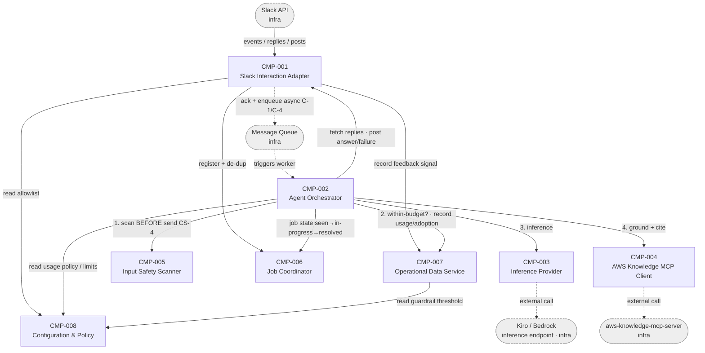

# Components

> Human-readable view of `components.yaml`. Same data — the YAML is the source of
> truth; if anything here disagrees with it, the YAML wins.
>
> Intent: **Slack DevOps Agent Bot** (`intent-001-slack-devops-agent`) ·
> Stage: `domain-design` (inception) · Owner: aidlc-app-architect-agent.
> Decomposition: balanced 8-component catalogue (human answer "agree to all",
> `questions.md` Q1–Q6). Logical blocks only — deployment grouping (single unit
> per A-4/C-4) is decided at units-generation.

## Component Diagram

*Solid edges = synchronous component-to-component calls. Dashed edges = the
asynchronous intake→worker handoff via the queue and the external infrastructure
calls. The numbered edges out of CMP-002 mark the in-order pipeline: safety gate
(CS-4) runs before inference (CMP-003) and MCP (CMP-004).*

## Component Summary

| Component ID | Component | Capability | Dependencies | Entities Owned |
|---|---|---|---|---|
| CMP-001 | Slack Interaction Adapter | Slack boundary in/out: validate & parse mentions, allowlist + bot-message filter, ack, fetch replies, post answers, capture reactions | CMP-008, CMP-006, CMP-007 | InboundMention, ReactionEvent |
| CMP-002 | Agent Orchestrator | Async worker / agent loop: context reconstruction, safety gate, budget check, inference+MCP grounding, answer composition, job resolution | CMP-001, CMP-005, CMP-007, CMP-003, CMP-004, CMP-006, CMP-008 | ConversationContext, Answer |
| CMP-003 | Inference Provider | Pluggable backend-agnostic LLM/SLM inference abstraction (A-1 seam) | — (external Kiro/Bedrock) | InferenceExchange |
| CMP-004 | AWS Knowledge MCP Client | Call AWS Knowledge MCP tools; return citable sources; signal ungrounded | — (external MCP server) | GroundingSource |
| CMP-005 | Input Safety Scanner | Pre-send secret/credential gate returning allow/warn/refuse (CS-4) | — | SafetyVerdict |
| CMP-006 | Job Coordinator | Async job lifecycle: seen/in-progress/resolved, at-most-once-completed de-dup, in-flight recovery | — (durable store is infra) | ProcessingJob |
| CMP-007 | Operational Data Service | Durable aggregate state (adoption, feedback, usage counter) + within-budget decision | CMP-008 | AdoptionMetric, FeedbackSignal, UsageCounter |
| CMP-008 | Configuration & Policy | Operator-set config: channel allowlist, usage policy, guardrail thresholds | — | ChannelAllowlist, UsagePolicy, GuardrailConfig |

**Not components (infrastructure / external dependencies):** Slack API, the
message queue (e.g. SQS), the Kiro/Bedrock inference endpoint,
`aws-knowledge-mcp-server`, and the durable datastore (e.g. DynamoDB) behind
CMP-006/CMP-007.

## Rationale

| Component ID | Component | Why it's a separate component |
|---|---|---|
| CMP-001 | Slack Interaction Adapter | Distinct concern (Slack transport + content shaping) and distinct change rate (tracks the Slack API), isolated from answer reasoning |
| CMP-002 | Agent Orchestrator | Owns the agent-loop reasoning — the system's core behaviour with its own reason to change, separate from transport, safety rules, and storage |
| CMP-003 | Inference Provider | The A-1 pluggability seam: the inference backend must be swappable (Kiro → Bedrock) without changing agent-core logic — a distinct, high-risk reason to change |
| CMP-004 | AWS Knowledge MCP Client | Encapsulates an external dependency and the grounding/citation contract (A-2); changes with the MCP tool surface, not with the agent loop |
| CMP-005 | Input Safety Scanner | Detection rules (A-6) evolve on their own cadence and the gate must run before any external send (CS-4) — distinct change rate + a reusable safety boundary |
| CMP-006 | Job Coordinator | Owns the ProcessingJob state machine; the de-dup-vs-retry tension (CS-3) and in-flight recovery (CS-2) are subtle, correctness-critical, hot-path state distinct from analytics |
| CMP-007 | Operational Data Service | Single owner of the CS-1 durable aggregate state; co-locates the cost counter with the within-budget rule (high cohesion); distinct access pattern (append-mostly + hot-path guardrail read) |
| CMP-008 | Configuration & Policy | Operator-facing, low-churn, read-mostly settings (S-15/17/18); one place to add/manage an operator setting, separate from the runtime data and enforcers that consume it |

## Entity Ownership (single owner per entity — CS-1 resolved)

| Entity | Owner | Durability | Notes |
|---|---|---|---|
| InboundMention | CMP-001 | transient | Parsed accepted mention + Slack coordinates; carries `correlation-id` (== `job-id`) stamped at intake (DA-1) |
| ReactionEvent | CMP-001 | transient | Captured 👍/👎 before it becomes a durable signal |
| ConversationContext | CMP-002 | ephemeral | Thread-scoped, fetch-not-store (A-8/OOS-4/CS-6) — never persisted |
| Answer | CMP-002 | transient | Recommendation + rationale + trade-offs + alternative + citations; carries `correlation-id` so `FeedbackSignal.answer-ref` is unambiguous (DA-1) |
| InferenceExchange | CMP-003 | transient | One inference round-trip incl. token usage |
| GroundingSource | CMP-004 | transient | Citable AWS doc source from an MCP tool call |
| SafetyVerdict | CMP-005 | transient | allow/warn/refuse; findings redacted (NFR-6) |
| ProcessingJob | CMP-006 | **durable** | De-dup identity + seen/in-progress/resolved state machine |
| AdoptionMetric | CMP-007 | **durable** | Distinct developers + questions per period |
| FeedbackSignal | CMP-007 | **durable** | 👍/👎 against a specific answer |
| UsageCounter | CMP-007 | **durable** | Per-period usage tally for the cost guardrail |
| ChannelAllowlist | CMP-008 | config | Operator-set allowed channels |
| UsagePolicy | CMP-008 | config | Operator-set data-sensitivity policy |
| GuardrailConfig | CMP-008 | config | Operator-set cost thresholds (values in nfr-design, A-7) |

The four CS-1 durable/shared-state concerns are single-owned: de-dup identity
lives in `ProcessingJob` (CMP-006); cost counter, feedback, and adoption live in
CMP-007. No entity has two owners.

## Validation (domain-modeling + units-decomposition skills)

- **No infrastructure modelled as a component** — Slack API, queue, inference endpoint, MCP server, and datastore are all dependencies, not components. ✓
- **Every entity has exactly one owner** — see the ownership table; CS-1 shared state resolved. ✓
- **Dependency directions explicit, no cycles** — the intake→worker handoff is asynchronous via the queue (infra), so CMP-001 does not synchronously call CMP-002; the only adapter↔orchestrator synchronous edge is CMP-002→CMP-001 (Slack I/O). Edge set: CMP-001→{008,006,007}; CMP-002→{001,005,007,003,004,006,008}; CMP-007→008. This is acyclic (a DAG). ✓
- **CS-4 ordering expressible** — CMP-002 calls CMP-005 (safety) before CMP-003 (inference) and CMP-004 (MCP); the numbered edges in the diagram encode the order. ✓
- **De-dup is at-most-once *completed*** — `ProcessingJob.status` is seen/in-progress/resolved (CS-3), not a one-shot "seen" flag, so a crashed-before-answer job can be reprocessed (CS-2). ✓
- **components.md consistent with components.yaml** — IDs, dependencies, and entities mirror the YAML. ✓

## Traceability — FR/story → component coverage

| Component | Requirements | Stories |
|---|---|---|
| CMP-001 | FR-1,2,3,4,14,16,17,20, NFR-1 | S-1,2,6,14,21,25 |
| CMP-002 | FR-4,5,6,7,8,9,10,11,12,13,17,18,21 | S-3,4,5,7,8,9,10,11,12,13,19,22,27 |
| CMP-003 | FR-5 | S-3 |
| CMP-004 | FR-6,7 | S-4,5 |
| CMP-005 | FR-15, NFR-4 | S-16 |
| CMP-006 | FR-19 | S-19,20,24 |
| CMP-007 | FR-16,18, NFR-8 | S-18,26,27 |
| CMP-008 | FR-2, NFR-3, NFR-8 | S-15,17,18 |

**Every FR-1..FR-21 maps to ≥1 component.** NFR placement:
NFR-1→CMP-001; NFR-3→CMP-008 (published) + CMP-005 (enforced); NFR-4→CMP-005;
NFR-8→CMP-007 (enforce) + CMP-008 (threshold). NFR-2/NFR-9 (latency/availability)
and NFR-5/NFR-6 (credential security / no-secrets-in-logs) and NFR-7/NFR-10
(rate-limit/concurrency) are cross-cutting quality constraints resolved in
nfr-design/infrastructure-design, not owned by a single component — they
constrain CMP-002 (loop budget CS-5), CMP-003/CMP-004 (external calls), and the
async-worker sizing. **S-23** (NFR-7 external rate-limit/backpressure handling)
is likewise a cross-cutting story — implemented across **CMP-001** (Slack API
rate limits) and **CMP-004** (MCP-server backpressure), not owned by a single
component — same footnoted treatment as the NFR-5/NFR-9/NFR-10 constraints above.

## Refinement — contributor feedback (aidlc-systems-architect-agent)

Refined 2026-06-17 against `aidlc-systems-architect-agent-contribution.md`. The
contributor endorsed the 8-component decomposition, boundaries, dependency
directions, and entity ownership with no objection, and requested exactly one
in-place domain-level change. Disposition of each finding:

| Finding | Disposition | Where |
|---|---|---|
| **DA-1** — no end-to-end correlation identity across the C-1 async boundary | **Applied in place.** Added `correlation-id` to `InboundMention` (CMP-001) and `Answer` (CMP-002); it equals `ProcessingJob.job-id` (CMP-006) as the canonical request id, stamped at intake and propagated for tracing + NFR-6 log hygiene. | `components.yaml` ENT-001/ENT-004; ownership table above |
| **DA-2** — within-budget check is a TOCTOU race under concurrency (NFR-10/S-24) | Accepted as **downstream design note** (no component change — boundaries are correct; only the consistency model behind CMP-007's decision needs pinning). Carried to functional-/nfr-design. | Notes below |
| **DA-3** — intake register/ack/enqueue ordering + conditional `ProcessingJob` write unspecified (CS-2/CS-3) | Accepted as **downstream design note** — an ordering/consistency contract, not a domain-model gap. Carried to functional-design. | Notes below |
| **DA-4** — nothing *drives* CMP-006 in-flight recovery (CS-2) | Accepted as **downstream design note** — entity already carries `last-transition-at`/`attempt-count`; the trigger (queue visibility timeout and/or reaper) is an infrastructure-design choice. | Notes below |
| **DA-5** — CMP-008 config reads sit on the NFR-1 (3s ack) hot path | Accepted as **downstream design note** — config is read-mostly by design; caching with bounded staleness is an nfr-/infrastructure-design decision. | Notes below |
| **DA-6** — over-budget denial folded into the FR-17 failure path | Accepted as **downstream design note** — keep distinct *reason codes* (guardrail-denied vs dependency-failed vs oversized-input) in functional-design; user message may stay similar. | Notes below |
| **DA-7** — NFR-7 backoff/retry consumes the NFR-2 budget, unowned | Accepted as **downstream design note** — the CS-5 loop iteration cap + per-request timeout must *include* retries; an nfr-design concern. | Notes below |

Minor notes from the contributor (Answer id, CMP-007's two access profiles,
stateless-worker scaling, NFR-5 absence) were reviewed: the `Answer` id is now
satisfied by `correlation-id` (DA-1); the rest were explicit confirmations or
infrastructure-design flags requiring no domain change.

## Notes for downstream stages

- **units-generation:** these 8 logical components are assumed to group into a
  single deployable unit (A-4/C-4); the intake→worker async boundary lives
  *inside* that unit. Whether CMP-006 and CMP-007 share one physical datastore is
  an infrastructure-design decision, not a domain one.
- **functional-design:** must implement the CMP-002 pipeline order (CS-4 safety
  gate first), the `ProcessingJob` state machine with at-most-once-completed
  de-dup + in-flight recovery (CMP-006, CS-2/CS-3), and the NFR-2 shared-budget
  cap (CS-5: hard tool-call iteration cap + per-request timeout in CMP-002).
  Also carries: **DA-3** (specify intake register/ack/enqueue ordering +
  compare-and-set on `ProcessingJob.status` seen→in-progress so two workers can't
  both claim a job); **DA-2** (define the guardrail as reserve-then-settle on
  `UsageCounter`, or declare it an explicit soft/best-effort bound); **DA-6**
  (keep distinct reason codes for guardrail-denied vs dependency-failed vs
  oversized-input/FR-21); and propagate `correlation-id` (DA-1) through the loop.
- **nfr-design:** carries **DA-2** (hard vs soft cost cap, A-7 thresholds),
  **DA-5** (allow CMP-008 reads to be cached in-process with bounded staleness so
  the NFR-1 3s ack budget isn't spent on a config round-trip), and **DA-7**
  (the CS-5 iteration cap + per-request timeout must include retry/backoff
  attempts so backoff and the loop share one bounded budget).
- **infrastructure-design:** carries **DA-4** (choose the CS-2 recovery trigger —
  queue visibility-timeout re-drive and/or a scheduled reaper over stale
  `in-progress` jobs), **DA-1** correlation-id propagation/observability, CMP-006
  vs CMP-007 store sizing and consistency model (the two CMP-007 access profiles —
  append-mostly analytics vs hot-path `UsageCounter` — may want different
  treatment), and the A-1 backend selection.
- **A-1 (Inference Provider, CMP-003)** remains the highest-risk seam — keep it
  backend-agnostic; de-risk before functional-design commits.
